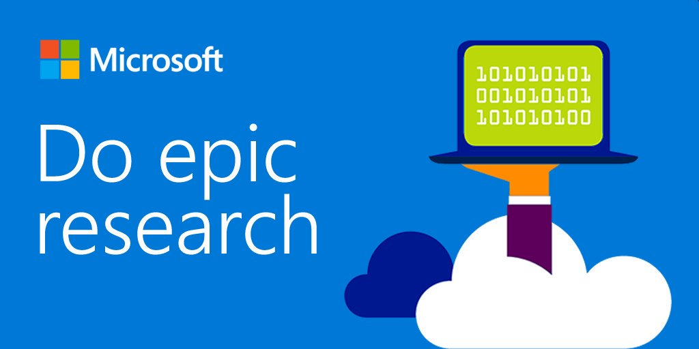

# Azure4Research Cloud Workshop 

#### [Created 25/Nov/2017]

This is a hands-on workshop providing a basic orientation and introduction to Microsoft Azure for Researchers & IT Staff supporting Research. 

The labs in this workshop are based on the content provided by the <a href="https://github.com/MSRConnections/Azure-training-course">Microsoft Research Azure Training Course</a>. The course provides a number of simple but powerful <a href="https://github.com/MSRConnections/Azure-training-course/tree/master/Content">introductory labs</a> on various topics that are relevant to Researchers, including Data Science & Big Data, Machine Learning, IoT, High Performance Computing and Big Compute with Azure Batch & Containers. 

Before beginning you may want to <a href="https://github.com/azurebigcompute/GettingStartedGuide/blob/master/GetTooledUp.md">install the Azure client tools</a> for your particular operating system. 

You should have received an Azure Pass from your instructor along with <a href="https://github.com/MSRConnections/Azure-training-course/blob/master/Content/Introduction/Introduction%20HOL.md">some instructions to redeem it</a>, but you are also free to run these labs in any subscription you have access to, and you can always sign up for a <a href="https://azure.microsoft.com/en-us/free/">free Azure Pass</a>. 
  
## Useful Links

#### Here are some pages, sites & tools we will refer to in the workshop: 

* Program Overview: https://www.azure4research.com/ 
* Redeem your Azure Pass: https://www.microsoftazurepass.com/ 
* Login to the Azure Portal: https://portal.azure.com/ 
* Download the labs: https://github.com/MSRConnections/Azure-training-course
* Create a Data Science VM: http://aka.ms/dsvm/ubuntu 
* Tools Overview: https://github.com/azurebigcompute/GettingStartedGuide/blob/master/GetTooledUp.md

#### Tool download links:
* Azure CLI: https://docs.microsoft.com/en-us/cli/azure/install-azure-cli 
* Storage Explorer: https://storageexplorer.com 
* Batch Labs: https://azure.github.io/BatchLabs/ 
* Jupyter Notebooks: https://notebooks.azure.com/ 
* Microsoft Documentation: https://docs.microsoft.com/ 
* Azure: https://docs.microsoft.com/en-us/azure/ 

#### Machine Sizing & Estimating Costs: 
* https://docs.microsoft.com/en-us/azure/virtual-machines/linux/sizes 
* https://azure.microsoft.com/en-us/pricing/details/virtual-machines/linux/ 
* https://azure.microsoft.com/en-us/pricing/calculator/ 
* https://azure.microsoft.com/en-us/pricing/ 

#### Links from the Presentations: 
* https://www.customvision.ai/ 
* https://aka.ms/jupytercambridge 
* https://www.software.ac.uk/research-software-engineering-cloud-computing-awards-microsoft 
* https://blogs.msdn.microsoft.com/azure_4_research/
* https://azure4research.azurewebsites.net/proposal/

***

http://aka.ms/a4rguide

