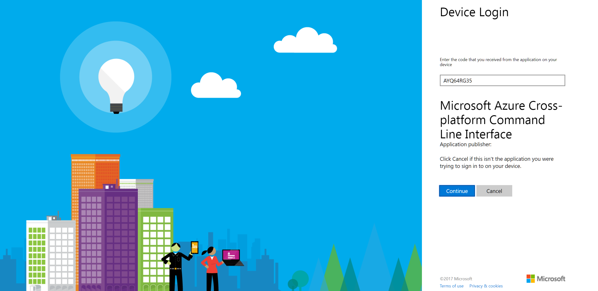

# Azure Batch AI Workshop

The <a href="https://docs.microsoft.com/en-us/azure/batch-ai/">lab example</a> we will be working through is a simple test to deploy an Azure Batch AI cluster and run a Microsoft CNTK training job on an MNIST handwriting dataset. We will alter the example to run on a CPU container rather than a GPU container. 

Before we get there we need to do some basic setup: 

## 1) Enable Your Subscription

Instructor will provide you with a code and guidance here. You will redeem your Azure Pass code via <a href="https://www.microsoftazurepass.com/">the AzurePass website</a>, which will enable your subscription and credit. You will need to provide an e-mail address, or can simply create a new outlook.com address. 

## 2) Deploy an Ubuntu Data Science VM

Follow the instructions under <a href="https://docs.microsoft.com/en-us/azure/machine-learning/data-science-virtual-machine/dsvm-ubuntu-intro">"Create your Data Science Virtual Machine for Linux"</a>

Be sure not to select the Deep Learning VM, but select the Data Science VM, as you do not yet have access to GPU nodes, it will not allow you to provision the Data Science VM. 

## 3) Login to Your Subscription via CLI + Web Browser

SSH to your Ubuntu Data Science VM, and login via the Azure CLI: 

```
azureuser@dsvm:~$ az login
To sign in, use a web browser to open the page https://aka.ms/devicelogin and enter the code AYQ64RG35 to authenticate.
```

The CLI waits at this point. Follow the instruction and login via a browser:

:
:

At this point the prompt returns in your linux window and you can continue again there: 
```
azureuser@dsvm:~$ az login
To sign in, use a web browser to open the page https://aka.ms/devicelogin and enter the code AYQ64RG35 to auth
enticate.
[
  {
    "cloudName": "AzureCloud",
    "id": "a0f92f07-9b51-4686-9233-c1ef4d19a8bf",
    "isDefault": true,
    "name": "Azure Pass",
    "state": "Enabled",
    "tenantId": "e0d1a93e-e295-42fc-954b-05b11079f167",
    "user": {
      "name": "kiernanek@outlook.com",
      "type": "user"
    }
  }
]
```
You can also check the subscription you are logged into is the correct one with:
```
azureuser@dsvm:~$ az account list -o table
Name        CloudName    SubscriptionId                        State    IsDefault
----------  -----------  ------------------------------------  -------  -----------
Azure Pass  AzureCloud   a0f92f07-9b51-4686-9233-c1ef4d19a8bf  Enabled  True
```

# Now we are logged in

## 1) Download the BatchAIQuickStart.zip

From your Ubuntu Data Science VM, just do:

```
wget 
```

## 2) Customize the job.json File

Unfortunately the default Azure Pass does not have GPU (N-Series nodes) enabled by default. You can fix this by opening a helpdesk ticket via the '?' icon in portal.azure.com, and request that N-Series is enabled for your subscription. 

However in the meantime for this workshop, we will simply replace the GPU container with a CPU container. Hence, please download <a href="job.json">This job.json</a>file. 

Note the key difference from the example is that we replace the GPU container:
```
 "containerSettings": {
         "imageSourceRegistry": {
             "image": "microsoft/cntk:2.1-gpu-python3.5-cuda8.0-cudnn6.0"
         }
     }
```
With an equivalent CPU container: 
```
     "containerSettings": {
         "imageSourceRegistry": {
             "image": "microsoft/cntk:2.1-cpu-python3.5"
         }
     }
```

# Next Steps

Congratulations! You have completed the workshop. Open a helpdesk ticket to enable GPU's in your subscription. Once the ticket has been fulfilled, re-run the test above and GPU, and compare the speed of the Training job. 
